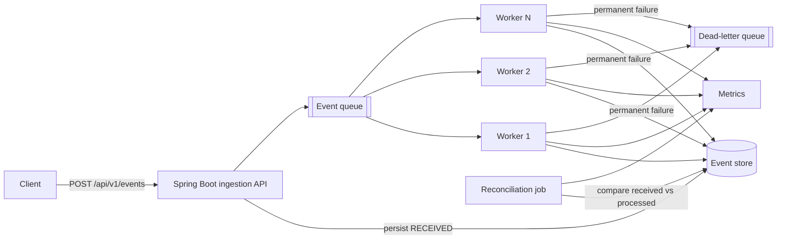

# Distributed Event Processing & Reliability Platform



A production-style Java backend designed around failure rather than only the happy path. It accepts events quickly, processes them asynchronously with concurrent workers, prevents duplicate side effects, retries transient failures with exponential backoff, isolates poison messages, detects silent loss, and publishes operational metrics.

## The reliability problem

At-least-once queues can redeliver messages. Workers can crash after completing a side effect but before acknowledging it. Dependencies can fail temporarily, poison messages can fail forever, and an event can disappear without producing an error. Success-rate monitoring alone cannot prove that every accepted event was processed.

This project makes those cases observable and testable. The first milestone runs locally with in-memory queue and repository adapters. The Terraform module provisions the corresponding AWS SQS, DLQ, DynamoDB, alarm, and dashboard resources. Connecting the Java adapters to those resources is the next deployment milestone; the README does not claim that the current local process already uses AWS.

## Current capabilities

- Java 21 and Spring Boot REST API
- asynchronous `DelayQueue` with four configurable workers
- ingestion and worker-side duplicate protection
- exponential retry delays and a bounded retry count
- dead-letter queue for permanent failures
- intentional transient, poison, and silent-drop modes
- scheduled reconciliation of accepted versus processed events
- Prometheus-format counters, queue gauges, and P50/P95/P99 timer data
- correlation IDs and structured key/value logs
- integration tests for success, duplicates, retries, DLQ, and silent loss
- multi-stage non-root Docker image
- Locust workload with duplicate injection
- Terraform foundation for SQS, DynamoDB, CloudWatch, and the DLQ

## Step-by-step: run the first milestone

### 1. Prerequisites

Install Java 21+ and optionally Docker. IntelliJ can import this repository directly from `pom.xml`. The checked-in Maven wrapper means a separate Maven installation is not required.

### 2. Run the tests

```bash
./mvnw test
```

The tests intentionally exercise normal processing, duplicate submission, transient retry, poison-message DLQ routing, and reconciliation.

On Windows PowerShell, use `.\mvnw.cmd test`.

### 3. Start the API

```bash
./mvnw spring-boot:run
```

Verify health:

On Windows PowerShell, start the application with `.\mvnw.cmd spring-boot:run`.

```bash
curl http://localhost:8080/actuator/health
```

### 4. Submit a normal event

```bash
curl -i -X POST http://localhost:8080/api/v1/events \
  -H "Content-Type: application/json" \
  -H "Idempotency-Key: order-123-created" \
  -H "X-Correlation-Id: checkout-456" \
  -d '{"event_type":"ORDER_CREATED","payload":{"order_id":"123","amount":49.99}}'
```

The API returns `202 Accepted`. Query its eventual state with:

```bash
curl http://localhost:8080/api/v1/events/order-123-created
```

### 5. Prove idempotency

Send the exact POST again with the same `Idempotency-Key`. The response has `duplicate: true`, the stored event count remains one, and no second work item is published. In AWS, the same rule will be enforced with a DynamoDB conditional write.

### 6. Exercise failures

Use these `event_type` values:

| Event type | Behavior | Expected result |
|---|---|---|
| `ORDER_CREATED` | Normal processing | `PROCESSED` on attempt 1 |
| `TRANSIENT_FAILURE` | Fails through `payload.failUntilAttempt` | Backoff, then `PROCESSED` |
| `POISON` | Every attempt fails | `FAILED` and present in `/api/v1/dlq` |
| `SILENT_DROP` | Worker returns without throwing | Reconciliation reports it missing |

Transient example:

```bash
curl -X POST http://localhost:8080/api/v1/events \
  -H "Content-Type: application/json" \
  -d '{"event_id":"retry-demo","event_type":"TRANSIENT_FAILURE","payload":{"failUntilAttempt":2}}'
```

Poison example:

```bash
curl -X POST http://localhost:8080/api/v1/events \
  -H "Content-Type: application/json" \
  -d '{"event_id":"poison-demo","event_type":"POISON","payload":{}}'
curl http://localhost:8080/api/v1/dlq
```

Silent-loss example:

```bash
curl -X POST http://localhost:8080/api/v1/events \
  -H "Content-Type: application/json" \
  -d '{"event_id":"drop-demo","event_type":"SILENT_DROP","payload":{}}'
```

After the configured five-second stale window, reconciliation emits `reconciliation_discrepancy` and sets `events_reconciliation_missing` above zero.

### 7. Inspect metrics

```bash
curl http://localhost:8080/actuator/prometheus
curl http://localhost:8080/actuator/metrics/events.processing.latency
```

Important series are `events_received_total`, `events_processed_total`, `events_failed_total`, `events_retried_total`, `events_dlq_total`, `events_queue_depth`, `events_reconciliation_missing`, and `events_processing_latency_seconds`. The processing timer publishes P50, P95, and P99 estimates.

### 8. Run in Docker

```bash
docker compose up --build
```

Stop it with `Ctrl+C`; run `docker compose down` when finished.

### 9. Run the load test

```bash
python -m venv .venv
source .venv/bin/activate
pip install -r load-tests/requirements.txt
locust -f load-tests/locustfile.py --host http://localhost:8080
```

On Windows PowerShell, activation is `.venv\Scripts\Activate.ps1`. Start with 20 users and a spawn rate of 5, then increase gradually. Save Locust results and metric screenshots. Do not publish the targets below as achieved until a test run proves them.

| Target | Measurement source |
|---|---|
| 1,000+ accepted events/minute | Locust request rate |
| Zero duplicate side effects | event repository plus duplicate metric |
| Automatic crash recovery | queue redelivery test in the AWS milestone |
| 100% injected-drop detection | reconciliation metric |
| Permanent failures isolated | DLQ depth |
| P50/P95/P99 processing latency | Micrometer/Prometheus timer |

### 10. Preview and deploy AWS foundations

```bash
cd infrastructure
terraform init
terraform fmt -check
terraform validate
terraform plan
terraform apply
```

`terraform apply` creates billable AWS resources and therefore should only be run in an account and region you intend to use. Add an API/worker compute target and least-privilege IAM policies when replacing the in-memory adapters with AWS SDK implementations.

## Design decisions

- **Queue before processing:** the API remains responsive while workers scale independently.
- **Persist the receipt first:** reconciliation needs a durable accepted-event ledger independent of processing success.
- **At-least-once plus idempotency:** delivery may repeat; side effects must not.
- **Exponential backoff:** retry delays are `initialDelay × 2^(attempt-1)`, limiting pressure on an unhealthy dependency.
- **Bounded retries and DLQ:** messages that cannot succeed stop consuming healthy capacity and remain inspectable.
- **Reconciliation:** error metrics find explicit failures; comparing accepted and processed records also finds silent loss.
- **Correlation IDs:** every event keeps one identifier across API, queue, worker, and logs.

## What happens when things fail?

**A duplicate arrives.** The ingestion service atomically creates the event only if its ID is absent. A repeated idempotency key returns the original state and is not queued. The worker also checks for `PROCESSED` before side effects, protecting against queue redelivery.

**A dependency fails temporarily.** The worker records `FAILED`, increments failure/retry metrics, and republishes the message with exponentially increasing availability delays. A later attempt can complete normally.

**A poison message never succeeds.** After the configured maximum attempts, it is added to the DLQ, its error and attempt count remain queryable, and the DLQ metric/CloudWatch alarm identifies it for investigation.

**A worker crashes.** The production SQS visibility timeout makes the unacknowledged message visible to another worker. The DynamoDB conditional idempotency record prevents a repeated side effect. The in-memory milestone cannot survive a whole-process restart; implementing and testing SQS/DynamoDB adapters is required before claiming this behavior in benchmarks.

**An event disappears silently.** No exception means the failure counter stays flat. The independent reconciliation job finds accepted records that did not reach `PROCESSED` before the stale threshold and emits a missing-event gauge and discrepancy log.

**The queue backs up.** Queue depth and processing-latency percentiles increase. In AWS, alarms should page on sustained age/depth and workers should scale from backlog-per-worker, with a ceiling that protects DynamoDB and downstream services.

## Delivery roadmap

1. **Local reliability core — implemented:** API, workers, idempotency, retries, DLQ, metrics, reconciliation, tests, Docker, and load generator.
2. **AWS adapters:** implement SQS publish/consume and DynamoDB conditional state transitions behind interfaces; use LocalStack for integration tests.
3. **Compute and IAM:** deploy API and worker containers to ECS Fargate (or API to ECS and reconciliation to Lambda/EventBridge), using separate least-privilege roles.
4. **Observability:** publish custom CloudWatch metrics, alarms for age/backlog/failures/missing events, and a complete dashboard.
5. **Failure campaign:** duplicate delivery, terminate a worker during processing, poison messages, throttled dependencies, and silent drops.
6. **Benchmark:** run at least 10,000 events, export Locust data, capture P50/P95/P99, document environment and bottlenecks, and publish only measured results.

## API reference

| Method | Path | Purpose |
|---|---|---|
| `GET` | `/actuator/health` | liveness/readiness foundation |
| `POST` | `/api/v1/events` | accept an event asynchronously |
| `GET` | `/api/v1/events/{eventId}` | inspect event state and attempts |
| `GET` | `/api/v1/events` | local demonstration ledger |
| `GET` | `/api/v1/dlq` | local demonstration dead letters |
| `GET` | `/actuator/prometheus` | scrape operational metrics |

## Portfolio evidence still to add

Add real dashboard screenshots, a Locust report, exact infrastructure costs, a worker-termination timeline, and measured latency/throughput after the AWS adapters are complete. Those artifacts turn architectural claims into evidence.
