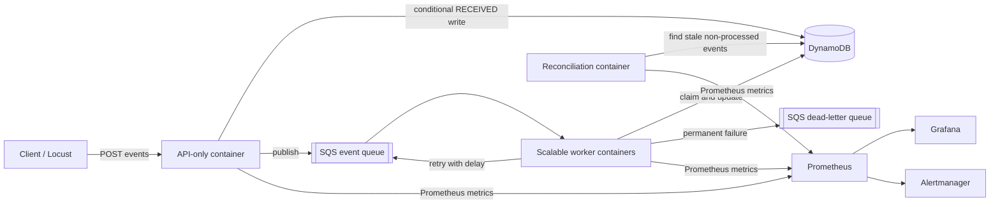

# Distributed Event Processing & Reliability Platform



A production-style Java backend designed around failure rather than only the happy path. It accepts events quickly, processes them asynchronously with concurrent workers, prevents duplicate side effects, retries transient failures with exponential backoff, isolates poison messages, detects silent loss, and publishes operational metrics.

## The reliability problem

At-least-once queues can redeliver messages. Workers can crash after completing a side effect but before acknowledging it. Dependencies can fail temporarily, poison messages can fail forever, and an event can disappear without producing an error. Success-rate monitoring alone cannot prove that every accepted event was processed.

This project makes those cases observable and testable. The default profile uses in-memory adapters for a fast development loop. The `aws` profile uses AWS SDK adapters for SQS, a dead-letter queue, and DynamoDB. Those adapters are validated against LocalStack; the Terraform configuration documents how the corresponding AWS resources could be provisioned.

> **Deployment status:** the AWS-compatible SQS and DynamoDB adapters are tested locally through LocalStack. This project has not been deployed to an AWS account. The Terraform files are infrastructure design artifacts and have not been applied.

See [Architecture](docs/architecture.md) for component boundaries, runtime modes, event states, recovery behavior, and observability flow.

## Current capabilities

- Java 21 and Spring Boot REST API
- interchangeable local `DelayQueue` and AWS SQS queue adapters
- DynamoDB conditional writes for durable idempotency and atomic worker claims
- explicit SQS acknowledgement and visibility-timeout retry semantics
- expiring processing leases for worker-crash recovery
- ingestion and worker-side duplicate protection
- exponential retry delays and a bounded retry count
- dead-letter queue for permanent failures
- intentional transient, poison, and silent-drop modes
- scheduled reconciliation of accepted versus processed events
- Prometheus-format counters, queue gauges, and P50/P95/P99 timer data
- correlation IDs and structured key/value logs
- integration tests for success, duplicates, retries, DLQ, silent loss, and processing leases
- opt-in LocalStack end-to-end failure tests for the AWS adapters
- multi-stage non-root Docker image
- Locust workload with duplicate injection
- unapplied Terraform design for SQS, DynamoDB, a DLQ, and basic CloudWatch resources

## Run the project

### 1. Prerequisites

Install Java 21+. Docker Desktop is optional for the in-memory application and required for LocalStack, separated containers, monitoring, failure campaigns, and load tests. IntelliJ can import this repository directly from `pom.xml`. The checked-in Maven wrapper means a separate Maven installation is not required.

### 2. Run the tests

```bash
./mvnw test
```

The tests intentionally exercise normal processing, duplicate submission, transient retry, poison-message DLQ routing, and reconciliation.

On Windows PowerShell, use `.\mvnw.cmd test`.

### 3. Start the API

```bash
./mvnw spring-boot:run
```

Verify health:

On Windows PowerShell, start the application with `.\mvnw.cmd spring-boot:run`.

```bash
curl http://localhost:8080/actuator/health
```

### 4. Submit a normal event

```bash
curl -i -X POST http://localhost:8080/api/v1/events \
  -H "Content-Type: application/json" \
  -H "Idempotency-Key: order-123-created" \
  -H "X-Correlation-Id: checkout-456" \
  -d '{"event_type":"ORDER_CREATED","payload":{"order_id":"123","amount":49.99}}'
```

The API returns `202 Accepted`. Query its eventual state with:

```bash
curl http://localhost:8080/api/v1/events/order-123-created
```

### 5. Prove idempotency

Send the exact POST again with the same `Idempotency-Key`. The response has `duplicate: true`, the stored event count remains one, and no second work item is published. Under the `aws` profile, DynamoDB enforces the same rule with `attribute_not_exists(event_id)`.

### 6. Exercise failures

Use these `event_type` values:

| Event type | Behavior | Expected result |
|---|---|---|
| `ORDER_CREATED` | Normal processing | `PROCESSED` on attempt 1 |
| `TRANSIENT_FAILURE` | Fails through `payload.failUntilAttempt` | Backoff, then `PROCESSED` |
| `POISON` | Every attempt fails | `FAILED` and present in `/api/v1/dlq` |
| `SILENT_DROP` | Worker returns without throwing | Reconciliation reports it missing |

Transient example:

```bash
curl -X POST http://localhost:8080/api/v1/events \
  -H "Content-Type: application/json" \
  -d '{"event_id":"retry-demo","event_type":"TRANSIENT_FAILURE","payload":{"failUntilAttempt":2}}'
```

Poison example:

```bash
curl -X POST http://localhost:8080/api/v1/events \
  -H "Content-Type: application/json" \
  -d '{"event_id":"poison-demo","event_type":"POISON","payload":{}}'
curl http://localhost:8080/api/v1/dlq
```

Silent-loss example:

```bash
curl -X POST http://localhost:8080/api/v1/events \
  -H "Content-Type: application/json" \
  -d '{"event_id":"drop-demo","event_type":"SILENT_DROP","payload":{}}'
```

After the configured five-second stale window, reconciliation emits `reconciliation_discrepancy` and sets `events_reconciliation_missing` above zero.

### 7. Inspect metrics

```bash
curl http://localhost:8080/actuator/prometheus
curl http://localhost:8080/actuator/metrics/events.processing.latency
```

Important series are `events_received_total`, `events_processed_total`, `events_failed_total`, `events_retried_total`, `events_dlq_total`, `events_queue_depth`, `events_reconciliation_missing`, and `events_processing_latency_seconds`. The processing timer publishes P50, P95, and P99 estimates.

### 7a. Run the local monitoring stack

Start the separated AWS-compatible services together with Prometheus, Alertmanager, and Grafana:

```powershell
docker compose --profile aws --profile monitoring up -d --build `
  localstack event-platform-aws event-worker-aws event-reconciliation-aws `
  alertmanager prometheus grafana
```

Open the local interfaces:

| Service | URL | Purpose |
|---|---|---|
| Grafana | http://127.0.0.1:3000/d/event-platform-overview/distributed-event-platform-overview | Provisioned dashboard; initial login `admin` / `admin` unless `GRAFANA_ADMIN_PASSWORD` is set |
| Prometheus | http://127.0.0.1:9090/query | PromQL query UI; enter a metric such as `events_received_total` |
| Alertmanager | http://127.0.0.1:9093 | Firing and resolved local alerts; an empty page means no alert is currently firing |

The dashboard includes received/processed throughput, failure/retry rate, queue and DLQ depth, duplicate and missing-event counts, API P50/P95/P99 latency, and processing P50/P95/P99 latency. Prometheus discovers scaled worker containers through Docker DNS and aggregates histogram buckets across them.

Local alert rules cover unavailable workers, sustained queue backlog, a non-empty DLQ, reconciliation discrepancies, elevated failure rate, and high P95 processing latency. Alertmanager intentionally has no external notification receiver in this local-only setup; its UI retains and groups alert state for demonstrations.

### 8. Run in Docker

```bash
docker compose up --build
```

Stop it with `Ctrl+C`; run `docker compose down` when finished.

### 8a. Run the AWS adapters with LocalStack

This starts LocalStack, creates both queues and the DynamoDB table, and runs separate API, worker, and reconciliation containers. Only the API is published to the host, on port `8081`:

```bash
docker compose --profile aws up --build localstack event-platform-aws event-worker-aws event-reconciliation-aws
curl http://localhost:8081/actuator/health
```

The same image supports four runtime modes through `PLATFORM_MODE`:

| Mode | Active application component |
|---|---|
| `api` | REST ingestion and query endpoints |
| `worker` | Queue consumers and event processing |
| `reconciliation` | Scheduled accepted-versus-processed checks |
| `all` | All components; the default for local development and tests |

Scale the independently deployable worker service with:

```bash
docker compose --profile aws up -d --scale event-worker-aws=3
```

Run the opt-in AWS integration test while LocalStack is running:

```bash
RUN_LOCALSTACK_TESTS=true \
AWS_ACCESS_KEY_ID=test \
AWS_SECRET_ACCESS_KEY=test \
AWS_REGION=us-east-1 \
./mvnw test -Dtest=AwsLocalStackIntegrationTest
```

PowerShell equivalent:

```powershell
$env:RUN_LOCALSTACK_TESTS="true"
$env:AWS_ACCESS_KEY_ID="test"
$env:AWS_SECRET_ACCESS_KEY="test"
$env:AWS_REGION="us-east-1"
.\mvnw.cmd test -Dtest=AwsLocalStackIntegrationTest
```

Run the deterministic worker-crash recovery demonstration from PowerShell:

```powershell
.\scripts\verify-worker-recovery.ps1
```

The script submits a `SLOW_PROCESSING` event, waits until a worker owns its DynamoDB processing lease, kills that worker container, restarts it, and waits for SQS redelivery. It succeeds only when the event is recovered on a later receive attempt and exactly one `event_processed` completion is present in the worker logs. The LocalStack queue uses a 10-second visibility timeout and workers use a five-second processing lease for this local demonstration.

Run the complete automated LocalStack failure campaign from PowerShell:

```powershell
.\scripts\run-localstack-failure-campaign.ps1 -SkipBuild -BacklogSize 50
```

By default, the campaign first purges both LocalStack queues and recreates the dedicated DynamoDB event table, giving each run an isolated baseline. Pass `-PreserveState` only when intentionally testing recovery from existing LocalStack state.

The campaign runs six AWS-adapter integration scenarios covering normal processing, duplicate submission and SQS redelivery, transient retries, poison-message DLQ routing, reconciliation of silent loss, and expired DynamoDB leases. It then performs real worker-container termination and recovery, queues a controlled backlog while the worker is stopped, restarts the worker, and measures the drain time. Finally, it submits fresh transient, poison, and silent-drop events through the running API so the Grafana failure/retry panels and local alerts have demonstrable data. The latest machine-readable result is written to `evidence/localstack/latest-failure-campaign.json`.

The latest isolated local smoke run on August 15, 2026 passed all six adapter scenarios and the worker-termination check. Its 50-event backlog reached a maximum queue depth of 50 and drained in 12.029 seconds. This is failure-recovery evidence, not the progressive load benchmark; the machine-readable evidence file is the source of truth for subsequent runs.

The poison and silent-loss scenarios intentionally leave the DLQ and missing-event metrics non-zero. After the alert hold period, Grafana displays those states and Prometheus fires `EventDlqNotEmpty` and `MissingEventsDetected`; Alertmanager then lists both alerts. Re-run the campaign whenever fresh demonstration evidence is needed.

### 9. Run the load test

The automated benchmark runs pinned Locust 2.40.4 in Docker, so no host Python installation is required. By default it purges the LocalStack queues and recreates the dedicated event table before the first stage. Omit `-SkipBuild` after application changes; use `-PreserveState` only when an accumulated table is intentional.

```powershell
.\scripts\run-progressive-load-test.ps1 `
  -UserLevels '20,50,100,250' `
  -StageSeconds 30 `
  -RampSeconds 5 `
  -WorkerReplicas 4 `
  -SkipBuild
```

Each stage starts only after the previous SQS backlog has drained. The harness writes Locust CSV and HTML reports, snapshots API counters, verifies every accepted event was processed, records the maximum queue depth and drain time, and calculates exact processing latency from persisted `received_at` and `processed_at` timestamps. The latest JSON summary is `evidence/load-tests/latest-progressive-benchmark.json`.

#### Measured LocalStack result

The following numbers are from the isolated August 15, 2026 run on Docker Desktop: one API container, four worker containers, one reconciliation container, 30-second stages, and a five-second ramp. They are local measurements, not AWS results.

| Users | Requests | Accepted | Accepted/min | Duplicates | Failures | Max backlog | Drain |
|---:|---:|---:|---:|---:|---:|---:|---:|
| 20 | 1,224 | 1,165 | 2,330 | 59 | 0 | 1,014 | 39.024s |
| 50 | 1,564 | 1,487 | 2,974 | 77 | 0 | 1,369 | 47.946s |
| 100 | 2,039 | 1,955 | **3,910** | 84 | 0 | 1,838 | 73.750s |
| 250 | 1,818 | 1,726 | 3,452 | 92 | 0 | 1,626 | 58.796s |

| Users | API P50 | API P95 | API P99 | Processing P50 | Processing P95 | Processing P99 |
|---:|---:|---:|---:|---:|---:|---:|
| 20 | 300ms | 650ms | 5,100ms | 31.500s | 38.563s | 39.755s |
| 50 | 700ms | 1,500ms | 4,800ms | 38.960s | 46.998s | 48.027s |
| 100 | 1,300ms | 2,500ms | 3,100ms | 52.084s | 72.191s | 73.561s |
| 250 | 3,300ms | 8,800ms | 12,000ms | 51.169s | 62.691s | 67.462s |

Across all stages, 6,645 requests produced 6,333 unique accepted events and 312 detected duplicate requests. All 6,333 accepted events reached `PROCESSED`, and Locust recorded zero failed requests. The measured target of 1,000 events/minute was exceeded, with peak throughput of **3,910 accepted events/minute at 100 users**. Adding concurrency beyond that point did not improve throughput and materially increased API tail latency.

### 10. Validate the Terraform design

```bash
cd infrastructure
terraform init
terraform fmt -check
terraform validate
terraform plan
```

These commands validate and preview the infrastructure design. This repository has not run `terraform apply`, and no AWS deployment or AWS cost claim is made.

## Design decisions

- **Queue before processing:** the API remains responsive while workers scale independently.
- **Persist the receipt first:** reconciliation needs a durable accepted-event ledger independent of processing success.
- **At-least-once plus idempotency:** delivery may repeat; side effects must not.
- **Exponential backoff:** retry delays are `initialDelay × 2^(attempt-1)`, limiting pressure on an unhealthy dependency.
- **Bounded retries and DLQ:** messages that cannot succeed stop consuming healthy capacity and remain inspectable.
- **Reconciliation:** error metrics find explicit failures; comparing accepted and processed records also finds silent loss.
- **Correlation IDs:** every event keeps one identifier across API, queue, worker, and logs.

## What happens when things fail?

**A duplicate arrives.** The ingestion service atomically creates the event only if its ID is absent. A repeated idempotency key returns the original state and is not queued. The worker also checks for `PROCESSED` before side effects, protecting against queue redelivery.

**A dependency fails temporarily.** The worker records `FAILED`, increments failure/retry metrics, and republishes the message with exponentially increasing availability delays. A later attempt can complete normally.

**A poison message never succeeds.** After the configured maximum attempts, it is added to the DLQ and its error and attempt count remain queryable. Locally, Prometheus and Alertmanager expose the non-empty DLQ; the unapplied Terraform design includes the equivalent basic CloudWatch DLQ alarm.

**A worker crashes.** SQS makes the unacknowledged message visible after its visibility timeout. The worker claim in DynamoDB has a shorter lease; after that lease expires, another worker can atomically reclaim the event. If the first worker completed before crashing, the `PROCESSED` state makes the redelivery acknowledge without repeating the side effect.

**An event disappears silently.** No exception means the failure counter stays flat. The independent reconciliation job finds accepted records that did not reach `PROCESSED` before the stale threshold and emits a missing-event gauge and discrepancy log.

**The queue backs up.** Queue depth and processing-latency percentiles increase. In AWS, alarms should page on sustained age/depth and workers should scale from backlog-per-worker, with a ceiling that protects DynamoDB and downstream services.

## Delivery roadmap

1. **Local reliability core — implemented:** API, workers, idempotency, retries, DLQ, metrics, reconciliation, tests, Docker, and load generator.
2. **AWS-compatible adapters — implemented:** SQS publish/consume/acknowledge/retry, DynamoDB conditional state transitions, expiring worker leases, an AWS DLQ publisher, and an opt-in LocalStack integration test.
3. **Runtime separation — implemented:** independently runnable API, worker, and reconciliation containers, plus a scripted LocalStack worker-crash recovery demonstration.
4. **Local observability — implemented:** Prometheus collection, a provisioned Grafana dashboard, and Alertmanager-backed local rules for throughput, failures, retries, queue/DLQ depth, missing events, and latency percentiles.
5. **LocalStack failure campaign — implemented:** automated duplicate delivery, transient and poison failures, DLQ routing, silent loss, expired leases, worker termination/recovery, and measured backlog recovery, with a JSON evidence artifact.
6. **Progressive benchmark — implemented:** isolated 20/50/100/250-user Locust stages, exported CSV/HTML/JSON evidence, exact API and processing P50/P95/P99, duplicate/failure accounting, queue maxima, and measured drain times.

## API reference

| Method | Path | Purpose |
|---|---|---|
| `GET` | `/actuator/health` | liveness/readiness foundation |
| `POST` | `/api/v1/events` | accept an event asynchronously |
| `GET` | `/api/v1/events/{eventId}` | inspect event state and attempts |
| `GET` | `/api/v1/events` | local demonstration ledger |
| `GET` | `/api/v1/dlq` | local demonstration dead letters |
| `GET` | `/actuator/prometheus` | scrape operational metrics |

## Portfolio evidence

Presentation-ready screenshots and their raw sources are indexed in [`evidence/presentation/README.md`](evidence/presentation/README.md). The package includes the benchmark and failure-state Grafana dashboards, 100- and 250-user Locust reports, Prometheus and Alertmanager firing alerts, LocalStack queue/DLQ contents, worker recovery/retry/DLQ logs, and reconciliation detecting silent loss.

To refresh the package after running the failure campaign, keep Docker Desktop and the local stack running, then execute:

```powershell
powershell.exe -NoProfile -ExecutionPolicy Bypass -File .\scripts\capture-presentation-evidence.ps1
```

These artifacts demonstrate AWS-compatible SQS and DynamoDB behavior through LocalStack only. They do not represent deployment to an AWS account.
