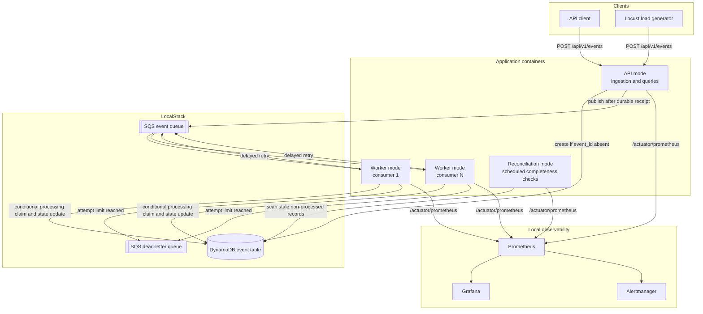
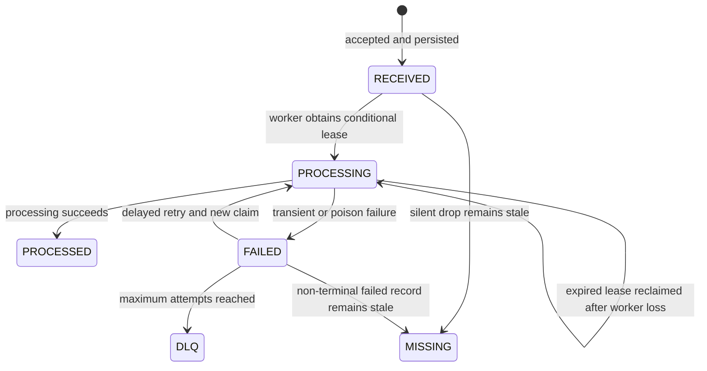
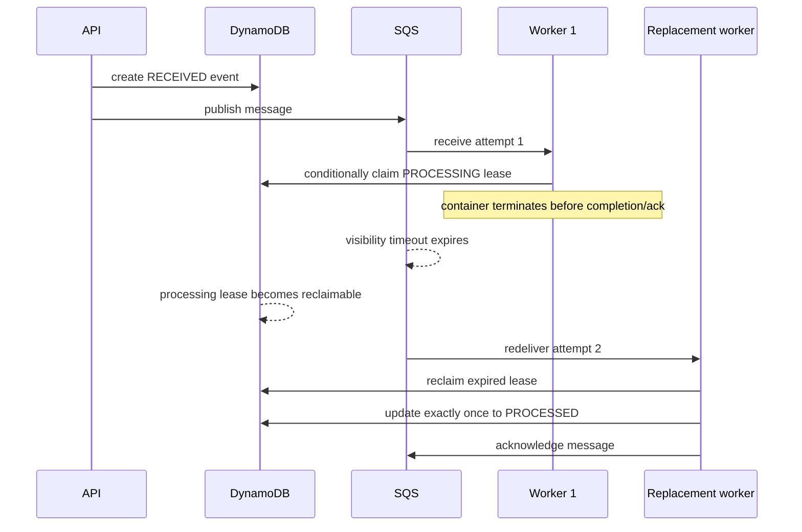

# Architecture

This document describes the architecture that is implemented and exercised locally. AWS-compatible SQS and DynamoDB adapters run against LocalStack; the repository has not been deployed to an AWS account, and its Terraform configuration has not been applied.

## Runtime topology

The same Spring Boot image runs in four modes selected by `PLATFORM_MODE`:

| Mode | Enabled behavior | Intended deployment |
|---|---|---|
| `api` | Ingestion and event-query endpoints | One or more stateless API containers |
| `worker` | Queue polling, claims, processing, retry, and DLQ routing | Independently scalable worker containers |
| `reconciliation` | Scheduled accepted-versus-processed comparison | Singleton service or scheduled job |
| `all` | API, workers, and reconciliation together | Fast in-memory development and tests |

## Event lifecycle

`MISSING` is an operational classification produced by reconciliation, not a persisted `EventStatus`. It represents an accepted record that has not reached `PROCESSED` within the configured stale window.

## Reliability guarantees

- **Durable acceptance before enqueue:** ingestion conditionally creates the event record before publishing work.
- **Idempotent ingestion:** an idempotency key or explicit event ID becomes the event key; a duplicate returns the existing record and is not republished.
- **Worker-side duplicate protection:** a redelivered message for a `PROCESSED` event is acknowledged without another completion.
- **Exclusive expiring claims:** DynamoDB conditional updates prevent concurrent ownership while allowing another worker to reclaim an expired lease.
- **At-least-once recovery:** if a worker terminates before acknowledgement, SQS makes the message visible again after its visibility timeout.
- **Bounded failure handling:** transient failures use exponential delayed retries; poison events move to the DLQ after the maximum attempt count.
- **Independent completeness detection:** reconciliation finds silent loss because it compares durable accepted records with terminal processing state instead of relying only on exceptions.

The processing action in this demonstration is the atomic transition to `PROCESSED`; a production integration would place its external side effect behind the same idempotency boundary, commonly using an idempotency record or transactional outbox.

## Worker-termination recovery sequence

The automated recovery script verifies a later receive attempt and exactly one `event_processed` completion in the worker logs.

## Observability and evidence

Prometheus scrapes each runtime component. Grafana visualizes received and processed throughput, failures and retries, queue and DLQ depth, duplicates, missing events, and API/processing latency percentiles. Prometheus rules route firing local alerts to Alertmanager; no external notification receiver is configured.

The repeatable failure campaign and progressive benchmark write machine-readable results under `evidence/`. Presentation-ready screenshots and their raw sources are indexed in [`evidence/presentation/README.md`](../evidence/presentation/README.md).

## AWS boundary

LocalStack validates the application’s AWS SDK interactions and queue/table semantics without requiring an AWS account. It does not prove behavior of a deployed AWS environment, IAM policies, ECS/Fargate operation, CloudWatch ingestion, AWS service quotas, or AWS costs. The files under `infrastructure/` are design artifacts for SQS, DynamoDB, DLQ, and basic CloudWatch resources only.
